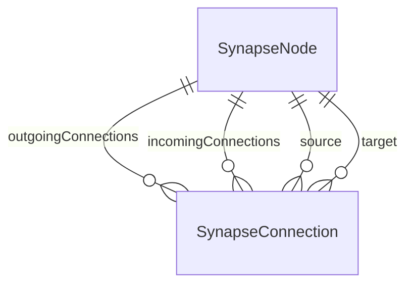

# PLAN_PHASE_1 - Architettura e Canvas Interattivo

## 1. File da Creare

| File | Descrizione |
|------|-------------|
| `Synapse/Models/SynapseNode.swift` | Modello SwiftData per i nodi della mappa |
| `Synapse/Models/SynapseConnection.swift` | Modello SwiftData per le connessioni (frecce) |
| `Synapse/ViewModels/MapViewModel.swift` | ViewModel `@Observable` per la logica della canvas |
| `Synapse/Views/CanvasView.swift` | Vista principale della canvas infinita |
| `Synapse/Views/Components/NodeView.swift` | Componente UI per singolo nodo |
| `Synapse/Views/Components/ConnectionView.swift` | Componente per disegnare le linee di connessione |

### File da Modificare

| File | Modifica |
|------|----------|
| `Synapse/SynapseApp.swift` | Aggiornare lo schema SwiftData con i nuovi modelli |
| `Synapse/ContentView.swift` | Sostituire il contenuto demo con `CanvasView` |

### File da Eliminare

| File | Motivo |
|------|--------|
| `Synapse/Item.swift` | Modello placeholder generato da Xcode, non più necessario |

---

## 2. Schema Relazioni SwiftData



### 2.1 Modello `SynapseNode`

```swift
@Model
final class SynapseNode {
    @Attribute(.unique) var id: UUID
    var text: String
    var x: Double           // Coordinata X persistente
    var y: Double           // Coordinata Y persistente
    var hexColor: String?   // Colore opzionale (es. "#FF5733")
    
    // Relazioni con deleteRule .cascade
    @Relationship(deleteRule: .cascade, inverse: \SynapseConnection.source)
    var outgoingConnections: [SynapseConnection] = []
    
    @Relationship(deleteRule: .cascade, inverse: \SynapseConnection.target)
    var incomingConnections: [SynapseConnection] = []
}
```

### 2.2 Modello `SynapseConnection`

```swift
@Model
final class SynapseConnection {
    var id: UUID
    var label: String       // Testo sulla freccia (es. "causa", "implica")
    
    var source: SynapseNode?
    var target: SynapseNode?
}
```

### 2.3 Strategia Eliminazione a Cascata

> [!IMPORTANT]
> **Problema:** Quando elimino un nodo, le connessioni che partono o arrivano a quel nodo diventerebbero "orfane", causando crash o dati inconsistenti.

**Soluzione:** Uso `deleteRule: .cascade` su **entrambe** le relazioni del nodo:

1. **`outgoingConnections`** (nodo → frecce in uscita): Se elimino il nodo A, tutte le frecce che *partono* da A vengono eliminate automaticamente.

2. **`incomingConnections`** (nodo → frecce in entrata): Se elimino il nodo B, tutte le frecce che *arrivano* a B vengono eliminate automaticamente.

**Flusso di eliminazione:**
```
Elimino NodoA
    ├── Cascade su outgoingConnections → Elimina ConnessioneA→B
    └── Cascade su incomingConnections → Elimina ConnessioneC→A
```

**Nota:** La relazione inversa nel `SynapseConnection` (`source` e `target`) **non** ha deleteRule. SwiftData gestisce automaticamente la nullificazione se necessario, ma grazie al cascade dal lato nodo, le connessioni vengono eliminate prima che questo diventi un problema.

---

## 3. Strategia Canvas: Coordinate DB vs CGPoint

### 3.1 Il Problema

- **SwiftData** persiste valori come `Double` (tipi primitivi).
- **SwiftUI** usa `CGPoint` per posizioni (`CGPoint(x: CGFloat, y: CGFloat)`).
- Devo garantire sincronizzazione fluida durante il drag (60fps+).

### 3.2 La Soluzione

```
┌─────────────────────────────────────────────────────────────┐
│                        SwiftData                            │
│   SynapseNode.x: Double    SynapseNode.y: Double            │
└─────────────────────────────────────────────────────────────┘
                              ▲
                              │ Conversione automatica
                              │ (computed property)
                              ▼
┌─────────────────────────────────────────────────────────────┐
│                     Estensione SynapseNode                  │
│   var position: CGPoint {                                   │
│       get { CGPoint(x: x, y: y) }                           │
│       set { x = newValue.x; y = newValue.y }                │
│   }                                                         │
└─────────────────────────────────────────────────────────────┘
                              ▲
                              │ Usato da
                              ▼
┌─────────────────────────────────────────────────────────────┐
│                        SwiftUI View                         │
│   .position(node.position)                                  │
│   .gesture(DragGesture()                                    │
│       .onChanged { node.position = $0.location })           │
└─────────────────────────────────────────────────────────────┘
```

### 3.3 Implementazione nel ViewModel

```swift
@Observable
class MapViewModel {
    var nodes: [SynapseNode] = []
    var connections: [SynapseConnection] = []
    
    private var modelContext: ModelContext
    
    // Aggiorna posizione in tempo reale durante il drag
    func updateNodePosition(_ node: SynapseNode, to point: CGPoint) {
        node.x = point.x
        node.y = point.y
        // SwiftData salva automaticamente grazie all'autosave
    }
    
    // Crea nuovo nodo alla posizione specificata
    func addNode(at point: CGPoint) {
        let node = SynapseNode(text: "", x: point.x, y: point.y)
        modelContext.insert(node)
        nodes.append(node)
    }
}
```

### 3.4 Perché Double invece di CGFloat?

1. **Portabilità:** `Double` è standard Swift, indipendente dalla piattaforma (su alcune piattaforme CGFloat è Float).
2. **SwiftData:** Serializza meglio tipi primitivi come `Double`.
3. **Precisione:** 64-bit sono più che sufficienti per coordinate canvas.

---

## 4. Struttura Canvas (Approccio MVP)

### 4.1 Architettura Scelta

```
ScrollView(.both, showsIndicators: true) {
    ZStack {
        // Layer 0: Background (click handler per nuovo nodo)
        Color.clear
            .frame(width: 5000, height: 5000)
            .contentShape(Rectangle())
            .onTapGesture(count: 2) { /* crea nodo */ }
        
        // Layer 1: Connessioni (Path Bézier)
        ForEach(connections) { connection in
            ConnectionView(connection: connection)
        }
        
        // Layer 2: Nodi (sopra le linee)
        ForEach(nodes) { node in
            NodeView(node: node, viewModel: viewModel)
        }
    }
}
.background(Color(nsColor: .windowBackgroundColor))
```

### 4.2 Interazioni MVP

| Azione | Risultato |
|--------|-----------|
| **Doppio tap** su sfondo | Crea nuovo nodo alla posizione |
| **Drag** su nodo | Sposta il nodo (aggiorna x/y in tempo reale) |
| **Click** su nodo | Seleziona per editing testo |

### 4.3 Flusso Creazione Connessione (Fase successiva)

Per ora la creazione connessioni sarà esclusa dall'MVP visuale, ma il ViewModel avrà già il metodo `createConnection(from:to:label:)` pronto.

---

## 5. Ordine di Implementazione

1. **Models** (`SynapseNode.swift`, `SynapseConnection.swift`)
2. **Schema update** (`SynapseApp.swift`)
3. **ViewModel** (`MapViewModel.swift`)
4. **Views** (`CanvasView.swift`, `NodeView.swift`, `ConnectionView.swift`)
5. **Integration** (`ContentView.swift`)
6. **Cleanup** (eliminare `Item.swift`)

---

## 6. Note Tecniche

> [!NOTE]
> - **macOS 14+** è il target, quindi possiamo usare tutte le API moderne di SwiftData e SwiftUI.
> - L'autosave di SwiftData è attivo di default, quindi le modifiche durante il drag vengono persistite automaticamente.
> - Per performance ottimali, le connessioni usano `Path` invece di `Shape` custom per evitare re-render inutili.

---

## Attendo il tuo "GO" per procedere con l'implementazione!
